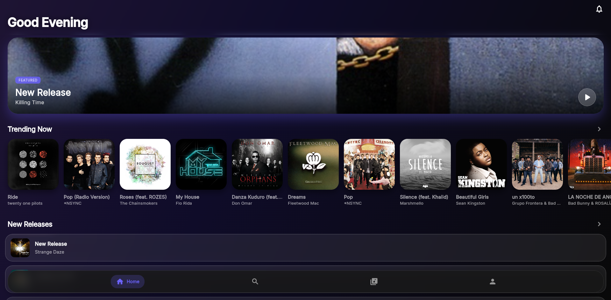
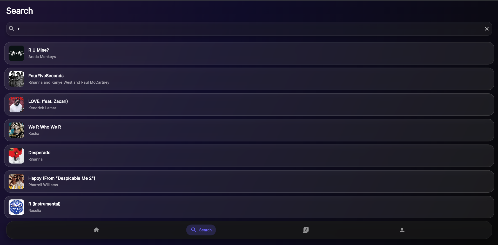
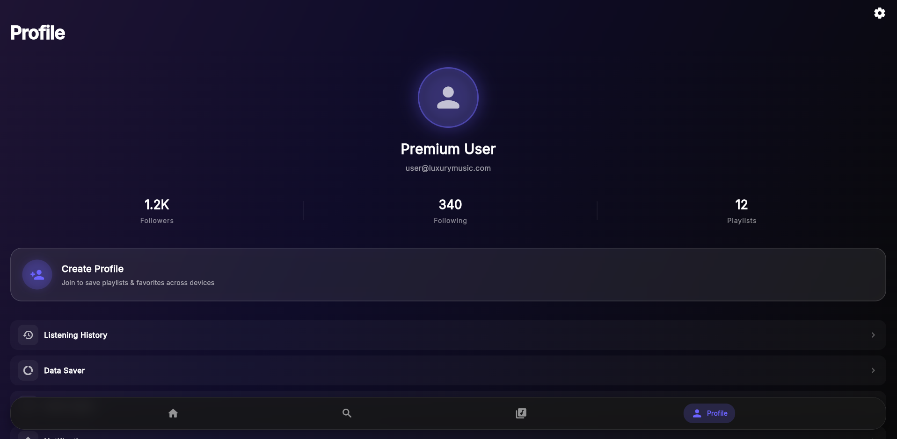
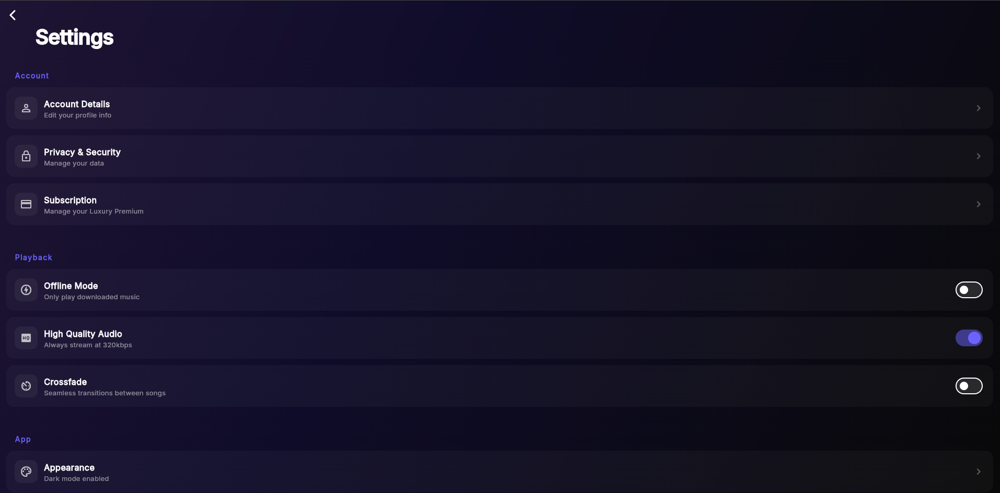

# Track Music (Luxury Music App)

A premium, state-of-the-art music streaming application built with Flutter. Designed with a luxury aesthetic inspired by Apple Music, Spotify Premium, and Nothing OS.

## 🌟 Features
- **Luxury Aesthetic**: Beautiful glassmorphic UI, smooth micro-animations, and dynamic 3-color dark gradients.
- **Massive Music Library**: Fetches over 800+ songs simultaneously for the Home tab.
- **Search & Discovery**: Fully functional search screen to find specific artists, tracks, or albums.
- **Library Management**: (Mock) Save your favorite tracks, manage playlists, and download songs for offline listening.
- **Complete Settings Suite**: Extensively modeled sub-menus for Account Details, Privacy & Security, Subscriptions, Appearance, Language, Audio Quality, Data Saver, and Notifications.
- **Offline Storage**: Integrated SQLite for caching and local persistence (mocked in UI).
- **Responsive Navigation**: State-of-the-art bottom navigation bar built with `GoRouter` using `ShellRoute`.

## 🔌 API Used
- **iTunes Search API**: Used for fetching real music data, album artwork, artist names, and track previews.
  - Endpoint: `https://itunes.apple.com/search`

## 📦 Packages Used
The following key Flutter packages power this application:
- **State Management**: `flutter_riverpod` (v3.3.2)
- **Routing**: `go_router` (v17.3.0)
- **Networking**: `dio` (v5.10.0)
- **Local Storage**: `sqflite` (v2.4.3), `shared_preferences` (v2.5.5)
- **UI & Animations**: `flutter_animate` (v4.5.2), `google_fonts` (v8.1.0), `flutter_screenutil` (v5.9.3)
- **Data Modeling**: `freezed_annotation`, `json_annotation`

## 🚀 How to Run Project

### Prerequisites
- Flutter SDK (v3.12.1 or higher)
- Dart SDK
- An emulator or connected physical device (iOS/Android/Windows/Web)

### Steps
1. **Clone the repository** (if applicable) or navigate to the project directory:
   ```bash
   cd music_app
   ```
2. **Install dependencies**:
   ```bash
   flutter pub get
   ```
3. **Generate Freezed/JSON Serializable files** (if you modify models):
   ```bash
   flutter pub run build_runner build --delete-conflicting-outputs
   ```
4. **Run the app**:
   ```bash
   flutter run
   ```
   *(Note: For the best visual experience, run on an iOS simulator, an Android device, or Windows desktop).*

## 📸 Screenshots

| Home Screen | Search Screen | Profile Screen | Settings Screen |
| :---: | :---: | :---: | :---: |
|  |  |  |  |

---
*Designed & Developed with Flutter.*
